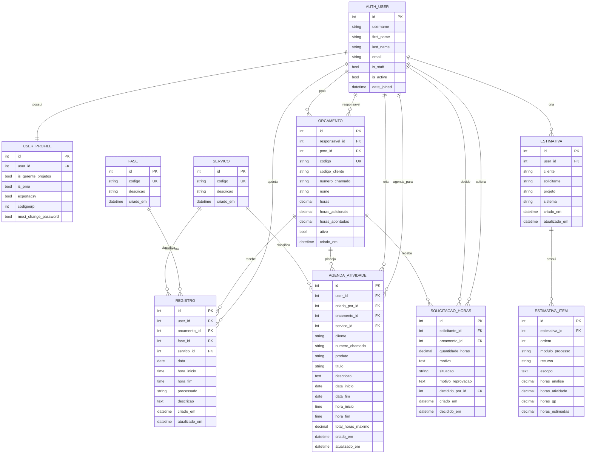

# Diagrama do Banco de Dados

Diagrama ER das principais tabelas usadas pelo sistema de apontamentos.

## Observacoes

- `REGISTRO.fase_id` pode ficar vazio.
- `REGISTRO.servico_id` e obrigatorio na regra da aplicacao, embora o campo aceite nulo para compatibilidade de dados.
- `AGENDA_ATIVIDADE.servico_id` e obrigatorio na regra da aplicacao, embora o campo aceite nulo para compatibilidade de dados.
- `ORCAMENTO.responsavel_id` e `ORCAMENTO.pmo_id` podem ficar vazios.
- `ORCAMENTO.pmo_id` deve apontar para um usuario com `USER_PROFILE.is_pmo = true`.
- `USER_PROFILE.exportacsv` controla exportacao CSV, filtro por usuario em registros e processamento dos registros.
- Tabelas internas do Django, como grupos, permissoes e sessoes, foram omitidas para manter o diagrama focado no dominio do sistema.
